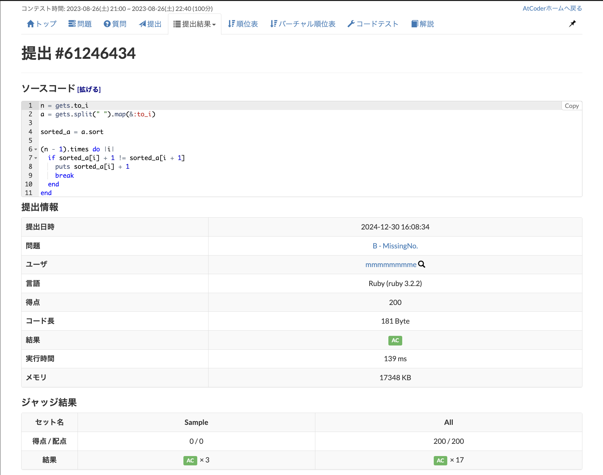
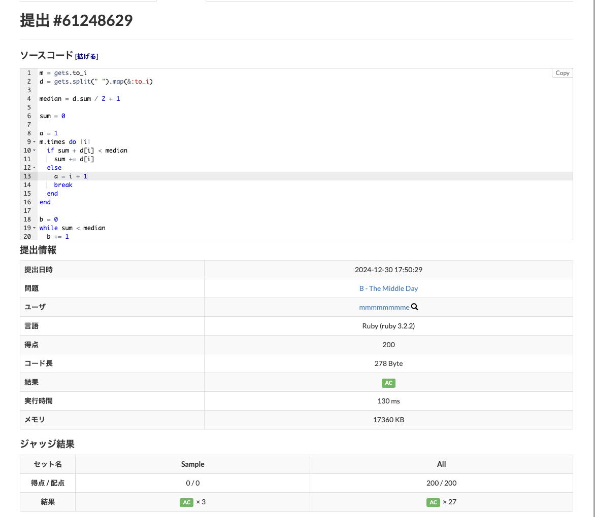
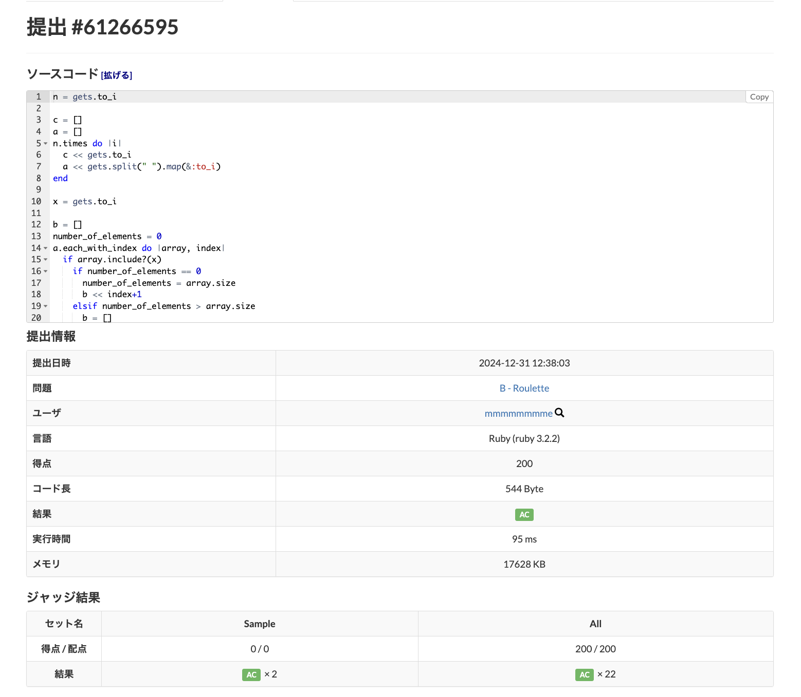
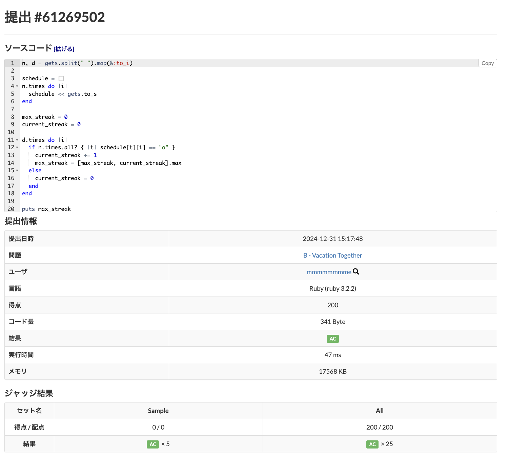
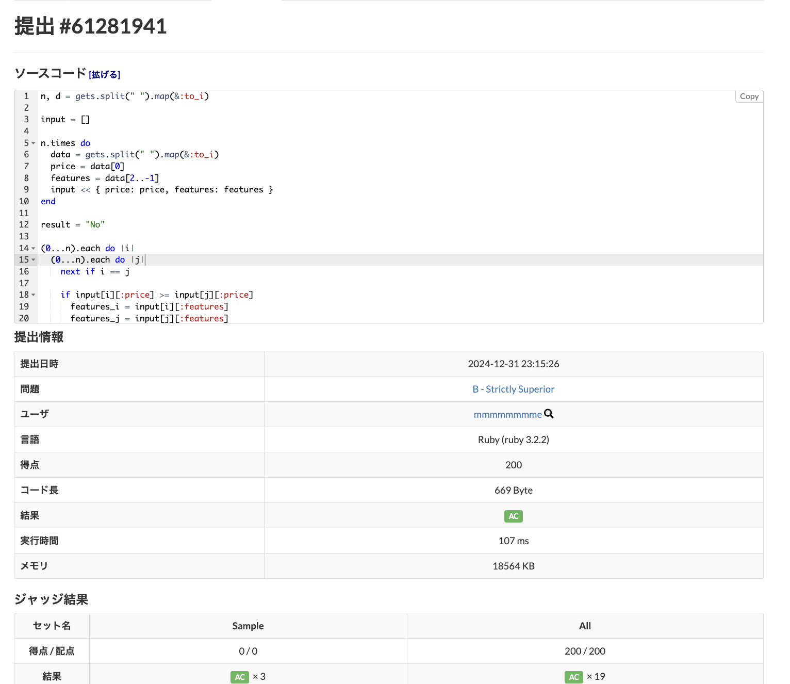
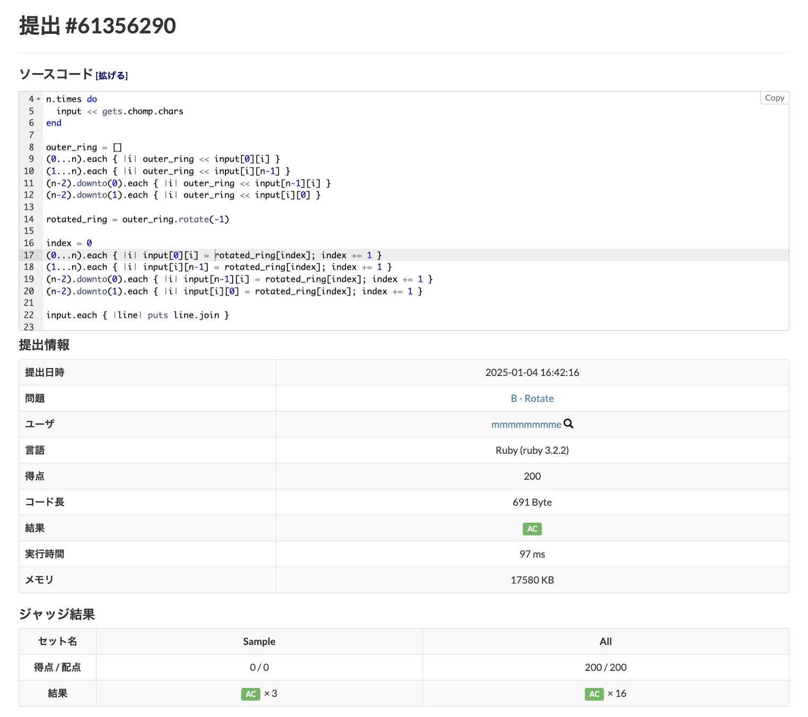
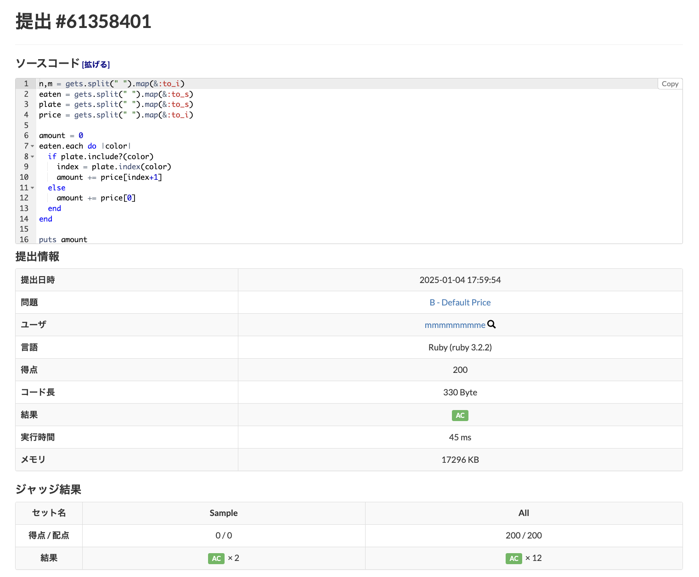
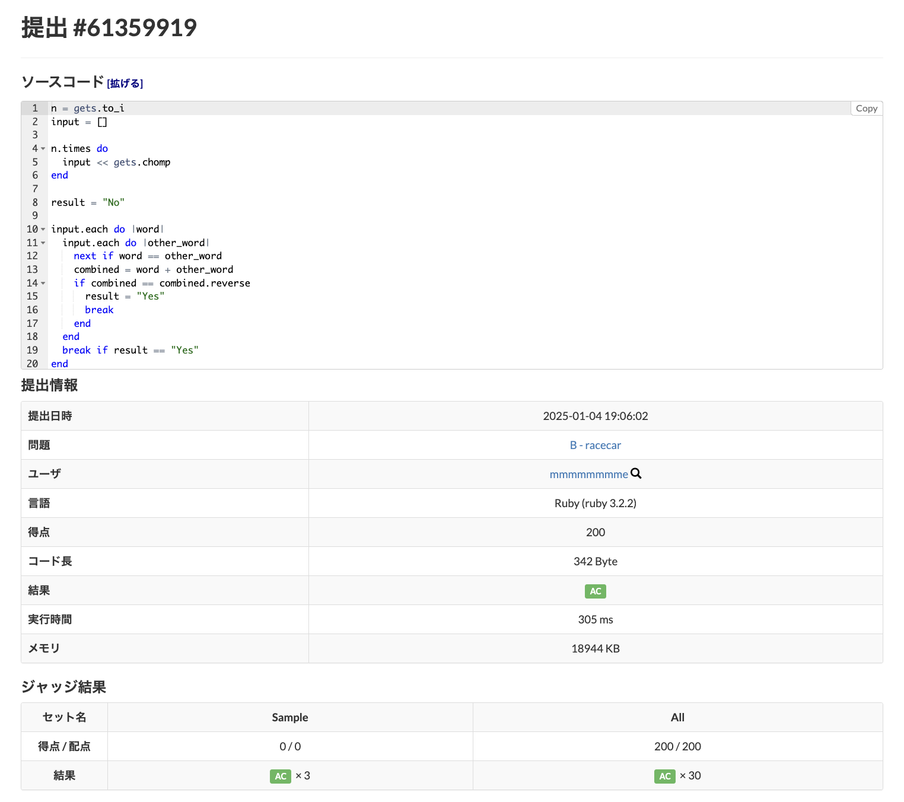
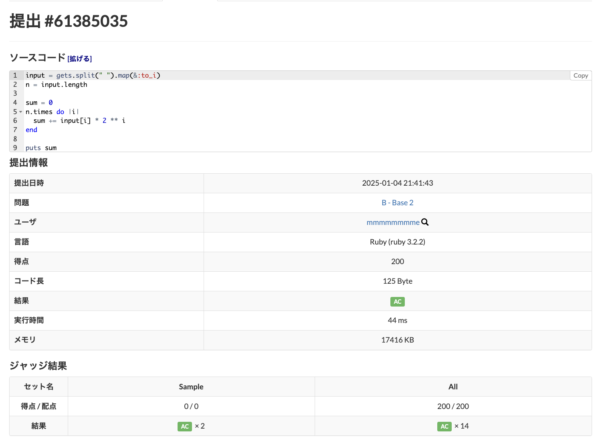
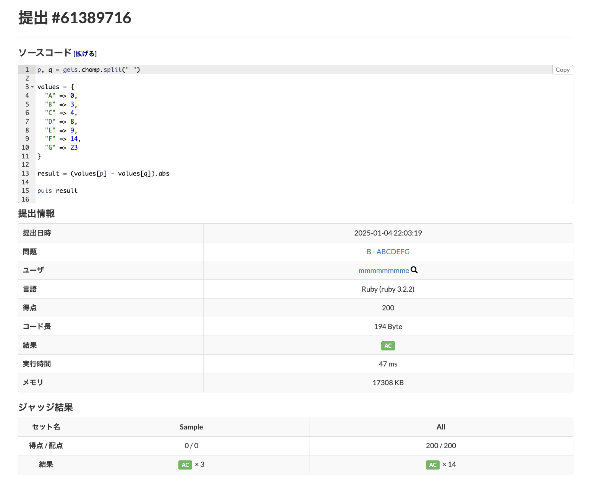

# 問題1
## 問題
https://atcoder.jp/contests/abc317/tasks/abc317_b

## 回答
https://atcoder.jp/contests/abc317/submissions/61246434

## 証跡

# 問題2
## 問題
https://atcoder.jp/contests/abc315/tasks/abc315_b

## 回答
https://atcoder.jp/contests/abc315/submissions/61248629

## 証跡

# 問題3
## 問題
https://atcoder.jp/contests/abc314/tasks/abc314_b

## 回答
https://atcoder.jp/contests/abc314/submissions/61266595

## 証跡

# 問題4
## 問題
https://atcoder.jp/contests/abc311/tasks/abc311_b

## 回答
https://atcoder.jp/contests/abc311/submissions/61269502

## 証跡

# 問題5
## 問題
https://atcoder.jp/contests/abc310/tasks/abc310_b

## 回答
https://atcoder.jp/contests/abc310/submissions/61281941

## 証跡

# 問題6
## 問題
https://atcoder.jp/contests/abc309/tasks/abc309_b

## 回答
https://atcoder.jp/contests/abc309/submissions/61356290

## 証跡

# 問題7
## 問題
https://atcoder.jp/contests/abc308/tasks/abc308_b

## 回答
https://atcoder.jp/contests/abc308/submissions/61358401

## 証跡

# 問題8
## 問題
https://atcoder.jp/contests/abc307/tasks/abc307_b

## 回答
https://atcoder.jp/contests/abc307/submissions/61359919

## 証跡

# 問題9
## 問題
https://atcoder.jp/contests/abc306/tasks/abc306_b

## 回答
https://atcoder.jp/contests/abc306/submissions/61385035

## 証跡

# 問題10
## 問題
https://atcoder.jp/contests/abc305/tasks/abc305_b

## 回答
https://atcoder.jp/contests/abc305/submissions/61389716

## 証跡

